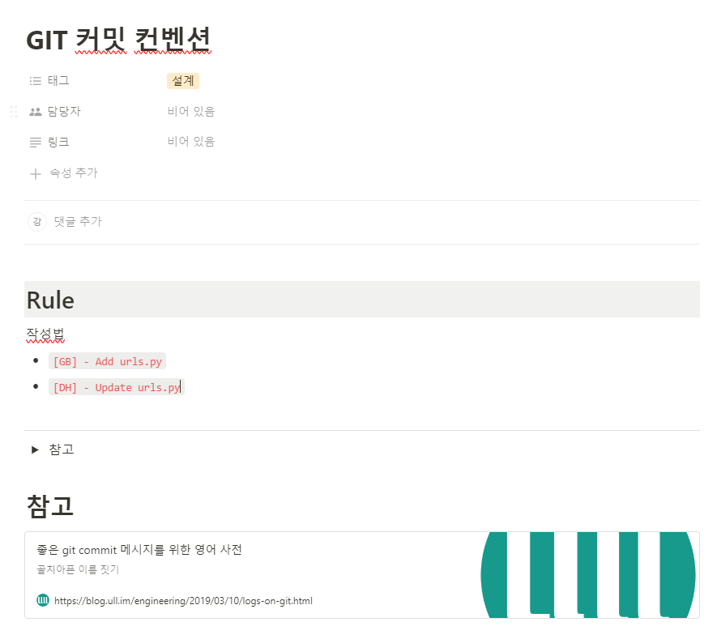
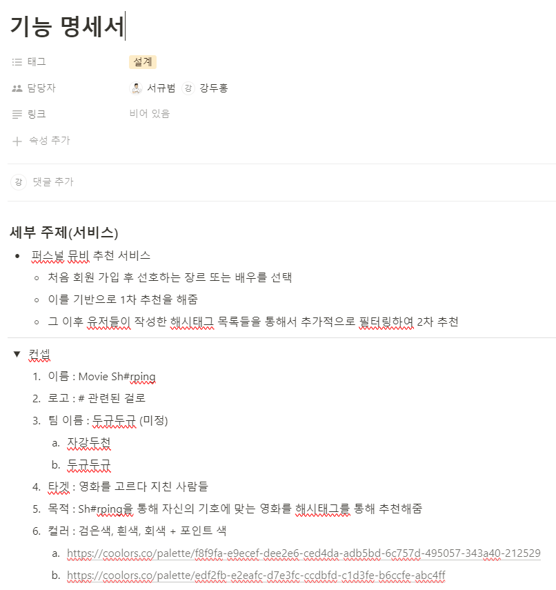
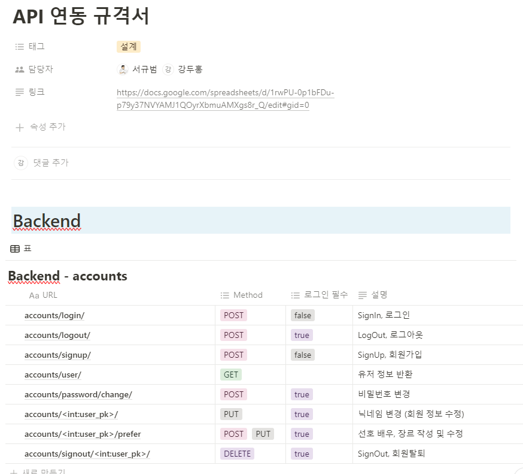
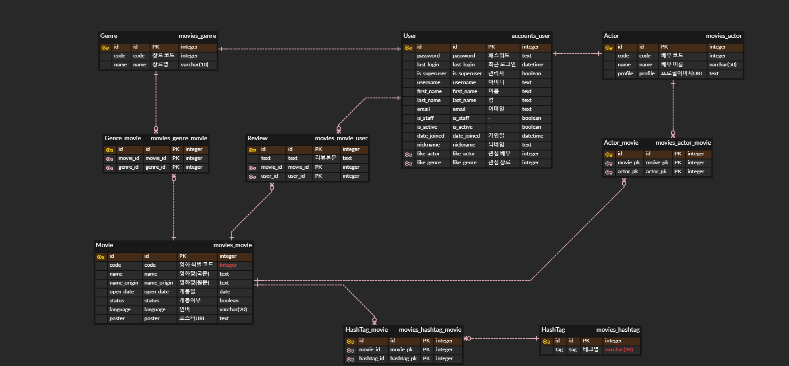

# final-pjt

## 프로젝트 배경

정형화되지 않은 자연어 기반의 추천 알고리즘을 반영한 영화 추천 웹 서비스 구현

## 팀 구성 및 역할

### 팀명 : `두규두규`

#### 서규범 [팀장]

- 백엔드(Django) 담당
- 사용 기술 : `Python`, `Django`, `Django-Rest-Framework`
- 기여도 : 백엔드(80%), 프론트엔드(20%)
- 주요 기여
  - **Django** | TMDB 데이터 수집 및 전처리 구현
  - **Django** | 추천 알고리즘 구현 (Django에서 필터링 후 JSON 형식으로 Vue 요청에 응답)
    - 1차 필터링 : DB에 저장된 유저 선호 장르/배우 기반 (OR 조건 검색)
    - 2차 필터링 : 선택 해시태그 기반 실시간 필터링 (OR 조건 검색)
  - **Vue** | 회원 정보 수정 전 비밀번호 검증 단계 구현

#### 강두홍 [팀원]

- 프론트엔드(Vue.js) 담당
- 사용 기술 : `JavaScript`, `Vue.js`, `html`, `css`
- 기여도 : 프론트엔드(80%), 백엔드(20%)
- 주요 기여
  - **Vue, JavaScript** | 해시태그 검색, 선택, 데이터 axios 방식으로 DB에 저장
    - tagify 라이브러리 사용
    - https://github.com/yairEO/tagify
  - **Vue, JavaScript** | 찜하기 기능 시 confetti 기능 설치
    - js confetti 라이브러리 사용
    - https://github.com/loonywizard/js-confetti
  - **Vue** | 네비게이션 가드를 통해 로그인한 유저만 진입 가능하도록 접근 제한
  - **Django** | 리뷰, 유저 정보 전송 및 수신

## 프로젝트 수행 절차 및 방법

#### 프로젝트 전체 기간

- 2024년 5월 16일 (목) ~ 2024년 5월 23일 (목)  [총 8일]

#### 프로젝트 수행 일정 세부 구분

- 설계(기획) : 2024년 5월 16일 ~ 17일
- 구현 : 2024년 5월 18일 ~ 23일
- 테스트 : 2024년 5월 23일

## 프로젝트 수행 결과

## AI 적용

OpenAI 사의 Chat GPT에 아래와 같은 프롬프트를 입력하여 **해시태그 더미 데이터 수집**에 활용했음

> 영화 리뷰에 사용할 만한 해시태그 500개 추천해 줘. 단,  아래 조건에 맞춰서 작성해 줘.
>
> - 한글로 작성
> - 각 태그는 하나의 파이썬 리스트 안에 요소로서 포함되도록 작성
> - "00영화"와 같은 단순 정보만 포함하지 말고, "무서움", "감동", "재밌음", "노잼", "인생영화" 등 다양한 형식으로 작성

## 후기

#### 서규범

SSAFY에 입과한 후 처음으로 진행한 단기 웹 사이트 개발 프로젝트였다. 학기 중 진행한 소규모 프로젝트는 다수 있었다. 웹 기획부터 구현 및 테스트까지 구체적인 가이드라인 없이 추상적인 명세를 기반으로부터 시작된 것은 본 프로젝트가 처음이었다. 그러다 보니 기획 단계부터 테스트에 이르기까지 짧은 기간이었지만 아쉬운 부분이 많이 남았다. 기획 단계에 더 기발한 아이디어를 생각하지 못 한 것에 대한 아쉬움도 크다. 하지만 구현 성공을 목표로 적지 않은 시간을 투자했으나 결국 중도 포기한 기능에 대해 큰 아쉬움이 남는다.

큰 아쉬움으로 기억될 기능은 소셜 로그인이다. 소셜 로그인은 근래 웹 서비스에서 반영되지 않은 것을 찾아보기 어려울 정도로 보편화된 기능이다. 그만큼 향후 실무에 투입된다면 수시로 마주할 구현 과제 중 하나이다. 이러한 이유로 본 프로젝트에서 유저 정보 관련 기능 중 우선 과제로 포함할 것을 팀원에게 강력하게 어필했으며, 실제 개발 과정 중 로그인하여 토큰을 DB에 저장하는 것까지 성공하는 등 상당 부분 구현이 완료되었다.

그럼에도 문제점이 발견되었고 이를 주어진 기한 내에 해결하지 못 할 것으로 판단하여 중도에 기능 구현을 포기하게 되었다. 발견한 문제점은 불안정하고 일관되지 않은 결과 도출이었다. 회원가입과 로그인 기능은 웹 서비스를 제공받기 위해 반드시 거쳐야 할 과정이다. 그러나 기능 구현 후 테스트하는 과정에 일관되지 못하고 불안정한 결과를 나타냈다. 사유는 다양했다. 사용했던 소셜 업체인 구글로부터 토큰값을 온전히 받아오지 못하는 경우가 빈번했으며, 카카오 REST API를 활용한 회원 가입 과정에서는 직접 커스텀한 `accounts.user`모델의 몇몇 필드에 데이터가 올바르게 삽입되지 않았다.

이외에도 크롬 브라우저의 웹 푸시 기능과 같은 주요 기능들에 대한 시도가 미흡했던 점에서 아쉬움이 남는 프로젝트였다. 하지만 프로젝트 과정에 팀원과 수시로 소통하며 앞으로 여러 차례 진행될 중/장기 프로젝트의 맛보기 과정이었다는 점에서는 큰 의미가 있는 경험이었다.

#### 강두홍
가이드라인 없이 진행되는 첫 프로젝트를 하면서 초기 설계가 정말 중요하다는 걸 느꼈다. 설계에 신경을 쓴다고 했지만 그래도 프로젝트를 하면서 누락된 부분들이나 잘못 설계한 부분을 발견하게 됐다. 그래도 초반에 에러 없이 정상적으로 작동되길 원하는 수준을 맞췄다는 점에 큰 의의가 있다.

html 요소들과 순수 css로 페이지 표현을 하려고 노력했으며 과정 중에 레이아웃 충돌이 많이 발생했다. 이를 수정하는 과정에서 태그들을 매칭시키고 레이아웃 충돌을 잡는 능력이 좀 더 향상된 것 같다. 또한 vue와 javascript를 통해 코드를 짜면서 관련 기능들을 검색하고 내가 원하는 기능을 제공하는 라이브러리를 찾는 실력이 늘었으며, 라이브러리를 적용시키기 위해 가이드 문서와 블로그 자료들을 통합적으로 파악하도록 시야가 확장됐다. 

과거 개발 블로그를 통해 confetti 기능을 추가하는 라이브러리가 있다는 것을 알게 됐고 좋아요 기능을 구현할 때 사용하면 참 좋겠다고 생각했는데 이를 적용해볼 수 있어서 좋았다. 이를 계기로 이 프로젝트의 근간이 되는 해시태그 기능을 구현하기 위해 고민할 때 tagify라는 라이브러리를 찾아 추가하도록 도전할 수 있었다. 

해당 프로젝트에서 총 3개의 라이브러리를 사용했는데 앞서 언급한 confetti js, tagify js, 그리고 마지막으로 swiper js가 있다. swiper 기능을 추가하고 싶어서 시도를 많이 했고 최후의 순간에 적용을 성공했다. 다만 시간이 부족하여 스와이프 기능만 구현됐고 네비게이션 기능이 안된다는 게 참 아쉽다. 그래도 다양한 라이브러리를 적용시켜 vue에 입혀볼 수 있어서 뜻깊었다.

vue를 다룰 때는 비동기 작업들을 더 학습할 필요성을 상기시켜줬다. 비동기적으로 새로고침없이 정보가 수정되게 하는 것, 그리고 비동기로 인해 실행 순서가 기존 자바스크립트 코드와는 달라지는 것을 고려하는 스킬을 더 늘려야할 것으로 보인다. 추가적으로 프론트를 주로 담당했지만 프론트 기능들을 온전히 작동시키기 위해서는 결국 백엔드의 코드를 보고 수정하게 되면서 백엔드 구조를 잘 알고 있어야 백엔드와 정보를 주고 받을 때 수월하다는 것을 느꼈다.

### 협업 툴 (Notion)

- [Notion](https://gyubeomseo.notion.site/b310b18f1ad34c809381b18db4ccd5fb?pvs=4)

### ※ Git commit rule

https://www.notion.so/gyubeomseo/GIT-e560ae49b0c94f76a0f86677304d1fa0?pvs=4

### ※ 기능 명세서

https://www.notion.so/gyubeomseo/bc377aaefde342f0b7e649649cf878d6?pvs=4

### ※ API 연동 규격서, URL 설계

https://www.notion.so/gyubeomseo/API-6584536afab64f8a9362aa17422f7050?pvs=4

### ※ ERD 설계

https://www.notion.so/gyubeomseo/ERD-efe6b89f2b1e49cb847d3f9460f551af?pvs=4

### ※ 컴포넌트 설계

https://www.notion.so/gyubeomseo/d26af82a1c884732b58bdd67f28e263e?pvs=4

### ※ 와이어프레임

https://www.notion.so/gyubeomseo/262a57ff158a4608844357a0c8b258a2?pvs=4
